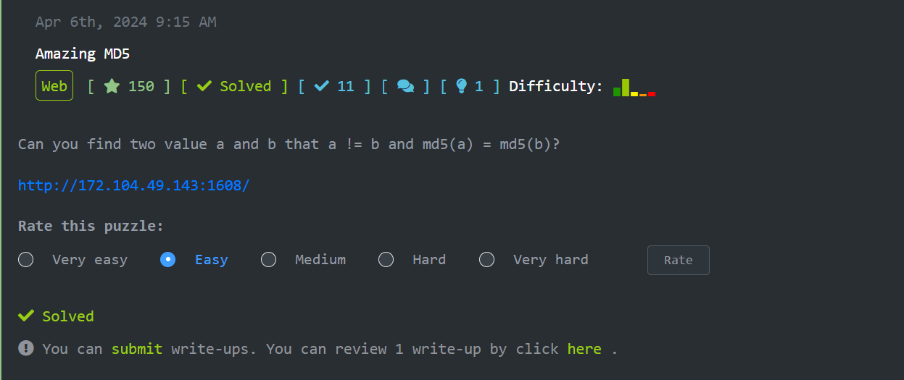

# CTF Write-Up: MD5 Collision Challenge

## Mô tả bài thử thách  
Bài thử thách tại [viblo](https://ctf.viblo.asia/) với tên Challenge là Amazing MD5

Trong bài thử thách CTF này, chúng ta cần khai thác một **lỗi so sánh MD5** trong PHP. 
  
Truy cập url của đề bài, chúng ta sẽ thấy mã nguồn PHP của đề bài  
  
Dưới đây là mã nguồn PHP của bài thử thách:

```php
<?php
include("flag.php");
highlight_file(__FILE__);
if (isset($_POST['a']) and isset($_POST['b'])) {
    if ($_POST['a'] != $_POST['b']) {
        if (md5($_POST['a']) == md5($_POST['b'])) {
            echo $flag;
        }
    } else {
        echo "Wrong!!!";
    }
}
?>
```

### Phân tích mã PHP

- **Mục tiêu của bài thử thách**: 
  - Chúng ta cần cung cấp hai chuỗi **khác nhau về giá trị** nhưng **có cùng giá trị MD5**. 
  - Khi điều kiện này thỏa mãn, server sẽ trả về **flag**.

- **Điều kiện kiểm tra**:
  - `$_POST['a'] != $_POST['b']`: Chuỗi `a` và `b` phải khác nhau.
  - `md5($_POST['a']) == md5($_POST['b'])`: MD5 của `a` và `b` phải giống nhau.

## Phân tích vấn đề

Bài thử thách này yêu cầu  khai thác tính năng **MD5 collision**, nghĩa là tìm hai chuỗi khác nhau nhưng khi tính giá trị MD5 của chúng thì kết quả lại giống nhau. Điều này có thể thực hiện được bằng cách sử dụng các kỹ thuật tấn công **hash collision** trong MD5.

## Giải pháp

### Bước 1: Tính toán MD5 của hai chuỗi
Trước tiên, ta cần đảm bảo rằng hai chuỗi có giá trị MD5 giống nhau. Sau một hồi tra google về từ khoá **MD5 collision** cuối cùng cũng tìm được cặp số thoả điều kiện hehe :

```python
string1 = "TEXTCOLLBYfGiJUETHQ4hAcKSMd5zYpgqf1YRDhkmxHkhPWptrkoyz28wnI9V0aHeAuaKnak"
string2 = "TEXTCOLLBYfGiJUETHQ4hEcKSMd5zYpgqf1YRDhkmxHkhPWptrkoyz28wnI9V0aHeAuaKnak"
```

Chúng ta sẽ tính giá trị MD5 của cả hai chuỗi này và kiểm tra nếu chúng giống nhau.  


### Bước 2: Gửi yêu cầu POST

Sau khi xác nhận rằng MD5 của hai chuỗi giống nhau, chúng ta sẽ gửi yêu cầu POST tới server với tham số `a` và `b`.

Dưới đây là mã Python giúp bạn gửi yêu cầu POST và nhận kết quả:

```python
import hashlib
import requests
string1 = "TEXTCOLLBYfGiJUETHQ4hAcKSMd5zYpgqf1YRDhkmxHkhPWptrkoyz28wnI9V0aHeAuaKnak"
string2 = "TEXTCOLLBYfGiJUETHQ4hEcKSMd5zYpgqf1YRDhkmxHkhPWptrkoyz28wnI9V0aHeAuaKnak"
url = 'http://172.104.49.143:1608/'  
data = {
    'a': string1,
    'b': string2
}
response = requests.post(url, data=data)
if "flag" in response.text:
    print("Flag tìm thấy:", response.text)
```

### Giải thích mã Python

1. **Gửi POST**: Chúng ta sử dụng thư viện `requests` để gửi yêu cầu POST tới URL của bài thử thách với các tham số `a` và `b`.
2. **Kiểm tra flag**: Nếu phản hồi từ server chứa từ khóa "flag", nghĩa là bạn đã tìm được flag và sẽ được in ra.

### Kết quả

Sau khi chạy mã Python, nếu tất cả các điều kiện đều thỏa mãn, chúng ta sẽ nhận được flag từ server. Kết quả như sau:

```
Flag tìm thấy: Flag{Amazing_md5_right!!!?}
```

### Tổng kết

- **MD5 Collision** là một kỹ thuật tấn công khai thác sự va chạm trong giá trị hash MD5. Mặc dù MD5 không còn được coi là an toàn, nhưng nó vẫn có thể được khai thác trong các thử thách CTF như thế này.
- Kỹ thuật này có thể được áp dụng trong nhiều tình huống khác nhau, đặc biệt là trong các bài CTF liên quan đến hash.

---

